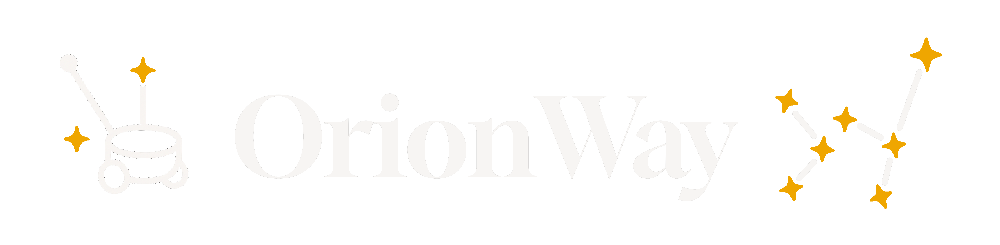
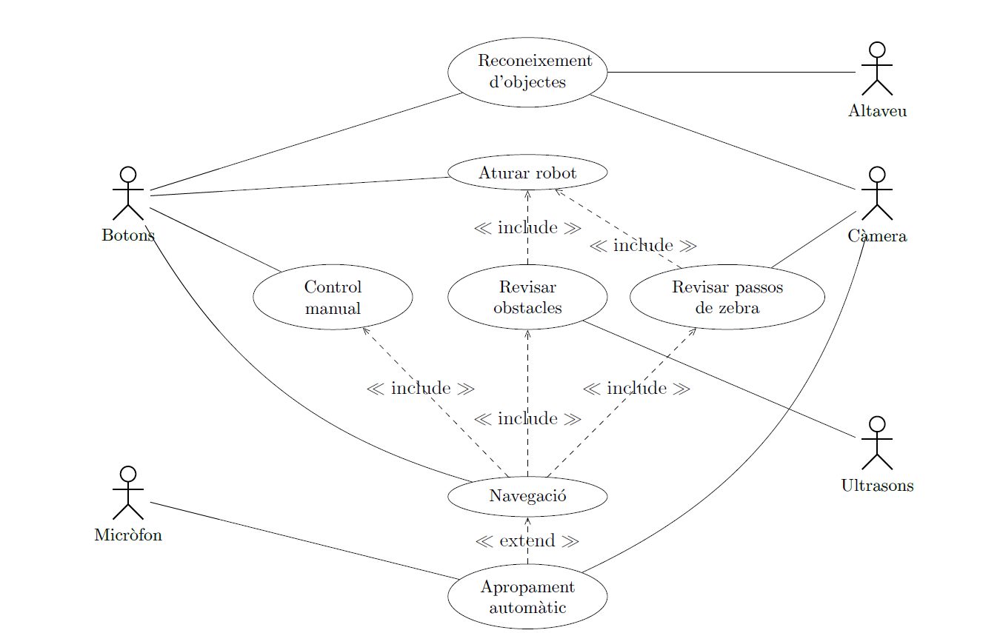
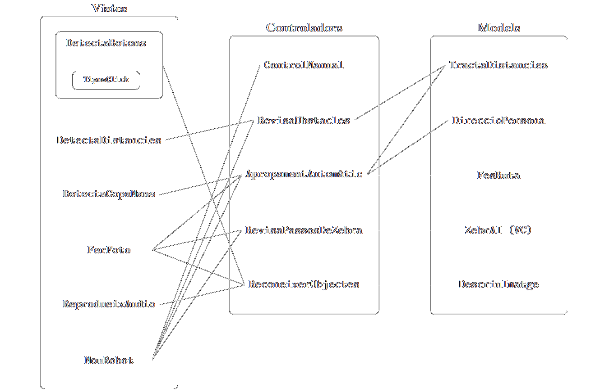
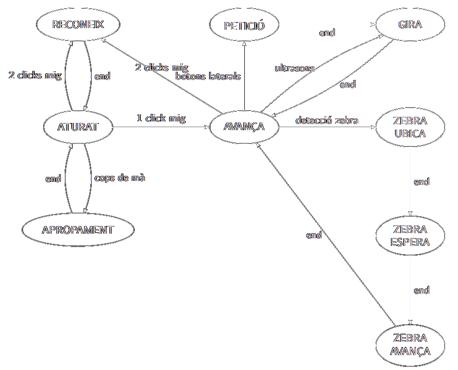
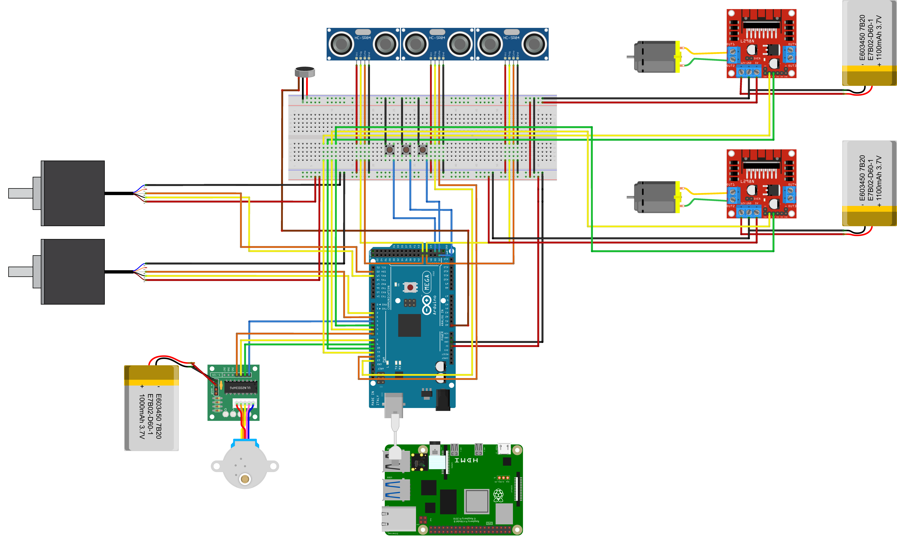

<p align="center">
  
</p>

# OrionWay:  El guia robot per a trobar el teu camí 🤖👨‍🦯

OrionWay és un **robot guia** dissenyat per acompanyar persones amb **discapacitat visual** en **entorns segurs**, com el campus de la Universitat Autònoma de Barcelona (UAB).

El projecte combina sensors i visió per computador per oferir assistència en el desplaçament, evitant perills com barreres, persones o passos de zebra. L’usuari mantindrà contacte amb el robot durant els trajectes, detectant quan el robot es desvia, dirigint-lo manualment o utilitzant-lo per identificar objectes desconeguts. L’objectiu és oferir una alternativa intermèdia entre un gos guia i el bastó blanc, combinant la seguretat i intuïció d’ambdós.

*El logotip d’OrionWay representa les inicials OW en codi Braille: ⠕⠺*

---

> [!CAUTION]
> Orionway és un prototip experimental desenvolupat en un entorn acadèmic i no està certificat per a ús assistencial en entorns reals. El seu ús com a substitut d’un gos guia o bastó blanc no està recomanat en entorns no controlats.

### 📚 Taula de continguts

- [🎥 Video demostració]()
- [💫 Funcionalitats]()
- [⚙️ Arquitectura i hardware]()
- [📋 Requisits i instalació]()
- [🖥️ Esquemes de software]()
- [🖧 Esquema de hardware]()
- [🧪 Tests i millores]()
- [🙌 Autors]()
- [🤝 Apoyo]()
- [📚 Bibliografía]()
- [📄 Llicència]()

### 🎥 Video demostració

### 💫 Funcionalitats del robot OrionWay

| **Funcionalitat** | **Demostració** |
|-------------------|-----------------|
| **Detecció i reacció a obstacles immediats**<br>Mitjançant els tres sensors d'ultrasons situats al cos del robot i connectats a la placa Arduino, aquest serà capaç de detectar elements propers i modificar la trajectòria dels motors per tal d'esquivar-los. Ha de ser una funcionalitat molt ràpida i eficient, per tal d'aconseguir el millor temps de reacció. |  |
| **Detecció i reacció a passos de zebra amb semàfors**<br>Mitjançant la càmera i un model de visió per computador, podrem saber l'orientació dels passos de zebra propers, a més de detectar si els seus semàfors es troben en verd o en vermell. Això permetrà encarar el pas de zebra i creuar-lo quan pertoqui, evitant el perill. |  |
| **Dirigir manualment el robot en qualsevol moment**<br>En qualsevol moment dins el guiatge del robot, l'usuari podrà prémer els botons del mànec per a forçar manualment girs a la dreta o a l'esquerra. \textbf{IMPORTANT:} Aquesta funcionalitat no tindrà més prioritat que les dues funcionalitats anteriors, és a dir, si a l'esquerra del robot es troba un obstacle immediat o un pas de zebra amb semàfor en vermell, el robot es detindrà. |  |
| **Reconeixement d'objectes i resposta per veu**<br>En qualsevol moment, l'usuari podrà preguntar al robot què subjecta a la seva mà mitjançant els botons situats al mànec. És a dir, utilitzant la càmera, el robot es detindrà, girarà la càmera, farà un reconeixement per imatge de l'objecte que l'usuari li mostri, i s'utilitzarà l'altaveu per a dir la resposta. |  |
| **Apropament automàtic cap a l'usuari en entorns tancats**<br>En situacions en què el robot té visió de l'usuari en un entorn tancat, aquest podrà ser cridat per l'usuari picant dues vegades de mans. Quan això succeeixi, el robot farà fotografies en tots els seus angles i detectarà la direcció on es troba l'usuari. Aleshores, utilitzant els sensors d'ultrasons, navegarà fins a l'usuari desplaçant-se al voltant dels obstacles que podrà trobar. |  |
   
### ⚙️ Arquitectura i hardware

L'arquitectura de software del nostre projecte está formada per:
 * Arduino
 * Python (Control Raspberry Pi)
 * YOLO (Detecció d'objectes)
 * ZebrAI (Projecte Visió per Computador que detectar semàfors i passos de zebra) [GitHub](https://github.com/albert-ce/ZebrAI-Crossing)

Respecte als components hem utilitzat el següent:
 * Arduino Mega 2560 [Datasheet](https://docs.arduino.cc/resources/datasheets/A000067-datasheet.pdf)
 * Raspberry Pi 4 4GB [Datasheet](https://www.farnell.com/datasheets/4170044.pdf)
 * Motor pas a pas 28BYJ-48 [Datasheet](https://www.mouser.com/datasheet/2/758/stepd-01-data-sheet-1143075.pdf)
 * Driver motor pas a pas ULN2003 [Datasheet](https://www.ti.com/lit/ds/symlink/uln2003a.pdf)
 * Motor 12V 455A105 [Datasheet](https://octopart.com/es/datasheet/455a105-2-globe+motors-19929790)
 * E2 optical encoder[Datasheet](https://www.usdigital.com/datasheets/e2-datasheet.pdf)
 * Sensor d'ultrasons HC-SR04 [Datasheet](https://leantec.es/wp-content/uploads/2019/06/Leantec.ES-HC-SR04.pdf)

### 🖥️ Esquemes de software
#### Casos d'us

#### Mòduls

#### Estats


### 🖧 Esquema de hardware
  

### 📋Requisits i instalació
- **Python**: 3.10 
- **Sistema operatiu**:
  - Per a `cloud-api`: Linux recomanat 
  - Per a `raspberry`: Raspbian o similar en Raspberry Pi.

### Requisits per a `cloud-api`

#### Dependències de Python

```bash
flask==3.1.1
gunicorn==23.0.0
ultralytics==8.3.111
opencv-python-headless==4.10.0.84
numpy==2.1.1
torch>=1.8.0
torchvision>=0.9.0
pillow>=10.3.0
PyYAML>=5.3.1
requests>=2.32.2
tqdm>=4.66.3
pandas>=1.1.4
```

#### Dependències del sistema (Linux)

```bash
sudo apt-get update && sudo apt-get install 
```

### Requisits per a `raspberry`

#### Dependències de Python

```bash
ultralytics==8.1.22
opencv-python==4.9.0.80
numpy==1.24.4
google-cloud-texttospeech==2.15.1
pygame==2.1.3
```

---

### Instal·lació ràpida

#### 1. Clona el repositori

```bash
git clone https://github.com/gabozan/Orionway
cd Orionway
```

#### 2. Instal·la Python 3.10 i pip si no els tens

#### 3. Instal·la les dependències per a cada subprojecte

##### Per a `cloud-api`:

```bash
cd cloud-api
pip install -r requirements.txt
```

##### Per a `raspberry`:

```bash
cd raspberry
pip install -r requirements.txt
```
---

### 🧪 Tests i milllores
  * En aquest projecte s'han fet una serie de tests per tal de comprovar que el funcionament es com esperem que sigui, totes aquestes proves es troben en [Tests](/docs/Tests.pdf)
  * Per altra banda, en aquest projecte hem tingut en compte unes posibles millores que té l'utilització del robot, tots aquests els hem recopilat en [Millores](/docs/Millores.pdf)  
### 🙌 Autors
  | Nom             | NIU         |
|----------------------|-------------|
| Albert Capdevila Estadella                     | 1587933            |
| Levon Kesoyan Galstyan                      |  1668018           |
| Luis Martínez Zamora                     | 1668180            |
| Sebastian Malbaceda                      | 1681519            |
|  Gabriel Rios Sanchez                    |  1671177           |

### 🤝 Suport
#### Institucions
[Escola Enginyeria - UAB](https://www.uab.cat/ca/enginyeria)

[UAB Open Labs](https://webs.uab.cat/openlabs/)

#### Professorat
* Fernando Luis Vilariño Freire
* Vernon Stanley Albayeros Duarte
* Carlos Garcia Calvo

### 📚 Bibliografía 
[Problemas y requisitos en el diseño de un robot de guiado para personas ciegas y mayores](https://publicaciones.asoc-aeim.es/anales/article/view/32/220)

[Una revisión de sistemas asistenciales basados en visión para personas con discapacidad visual: tecnologías, aplicaciones y direcciones futuras.](https://chatpaper.com/es/chatpaper/paper/138956)

### 📄 Llicència
  Aquest projecte està llicenciat sota la Llicència MIT.
